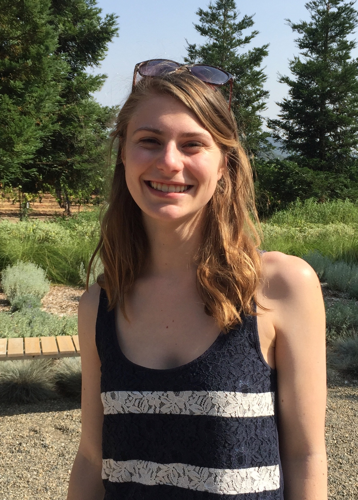
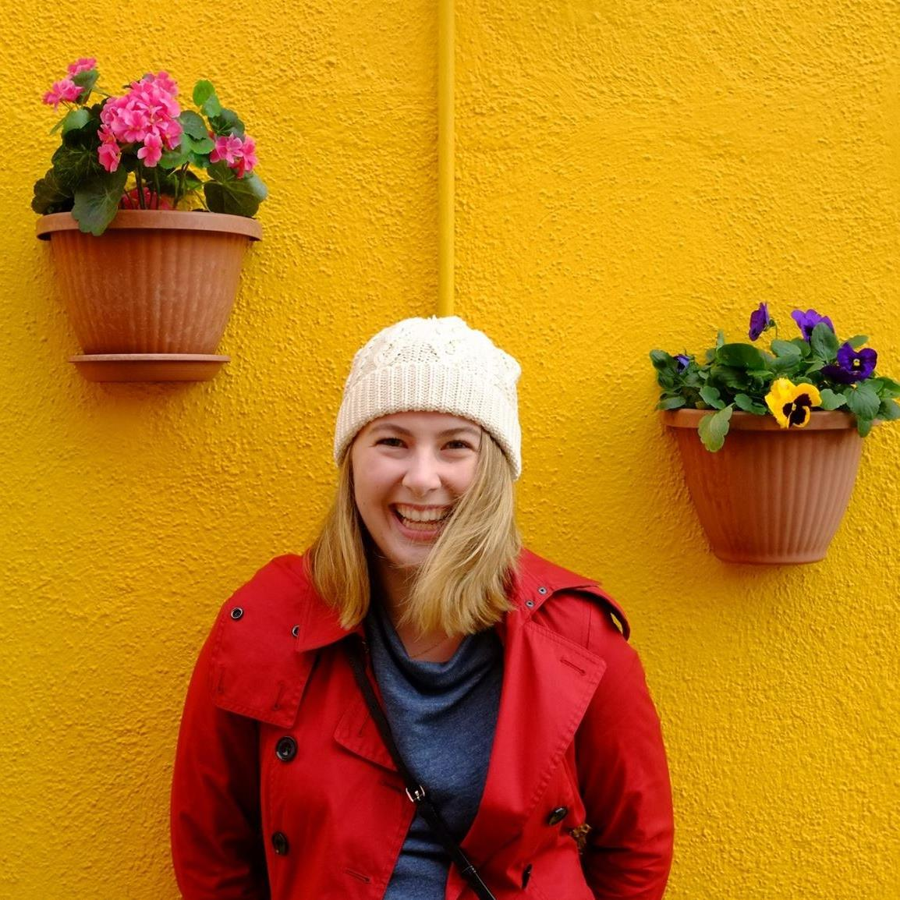

# Team-11
<!--- Logo Image --->

## Project Synopsis 

## Team Members
| Member                | Photo                                         |
| --------------------- | --------------------------------------------- |
| Austin Jacobs         |   |
| Kathleen Kenealy      |   |
| Josh DuFault          |  |
|                       |  |

<!---  --->

## Team Skills
| Member                | Skills                        | Personal Traits  | Desired Growth | Weaknesses |
| --------------------- | ----------------------------- | ---------------- | -------------- | ---------- |
| Austin Jacobs    | Web/Mobile developement, Spark, Databases, NLP | Organized, motivated, detail-oriented | UI design, project management | Perfectionist |
| Kathleen Kenealy | ML, NLP, Python, algorithms/theory & analysis, UI/UX | Collaborative, dedicated, organized | OOD, full stack integration/design | Less experienced with full stack design |
| Josh DuFault | ML, Deep Learning, NLP, Data Analysis, Spark, Python, C++, Java | Collaborative, dedicated | SDLC | UI |
| | | | |

## Team Communication

Planning on using slack?

## Contact Information

Austin Jacobs: ajacobs7@stanford.edu

Kathleen Kenealy: kkenealy@stanford.edu

Josh DuFault: jdufault@stanford.edu
