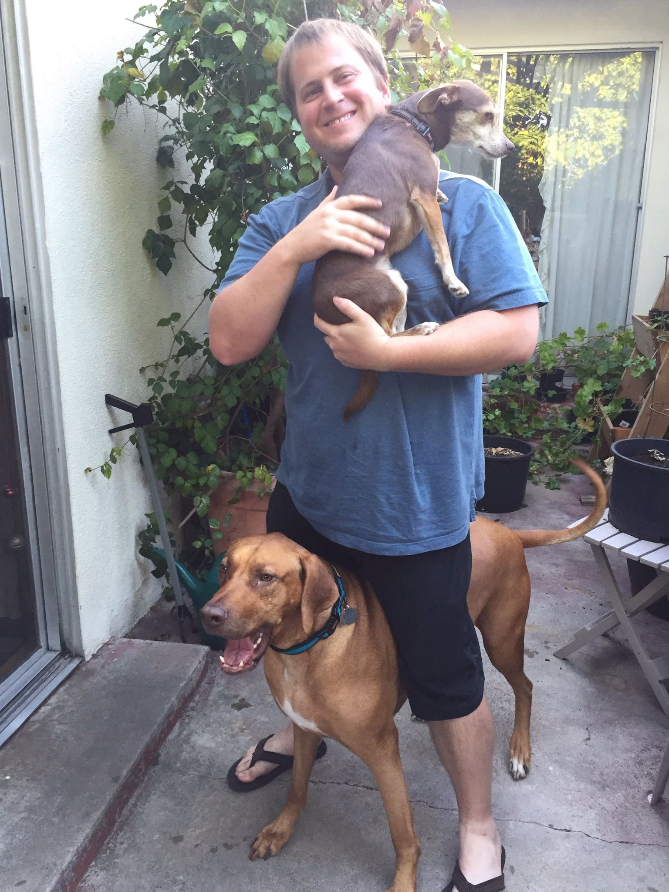

# The Giving World

## Project Synopsis 
 There are an overwhelming number of charities and non-profits; the National Center for Charitable Statistics estimates that there are 1.5 million charities in the United States alone. Many of these organizations seek to address the same issues, so it can be difficult for donors to find and choose where to give, even if they've decided on a particular social issue they want to focus on. After donating, the struggle continues as donors often cannot find information about how their donations are being used. 
 
 It should be easy to connect donors to causes. Compared to the major societal issues that many of these non-profits tackle, picking a charity should be simple. Straightforward. That is why the goal of our project is to make it easy for people to find places to donate, to connect people to charities based on their giving needs, interests, and other important factors.
 
 With this idea in mind, we propose "The Giving World" - a website that allows for people to find and review charities, making it easy to select a non-profit to donate to. The main purpose of our website is to match donors to non-profits using factors such as giving needs (does the donor want to give money, time, resources, etc.), interests (does the donor care most about animals, climate change, etc.), and even location (does the donor want to support their own community, etc.). In order to aid our ability to match donors, we also hope to provide a section of our website that can be used to rate and review charities. This will allow donors to discuss how funds are being allocated and may encourage transparency among non-profits. 
 
 We hope to extend this basic functionality with a few extensions. For example, we would like to set up a notification system that allows donors to be notified when a new non-profit or new opportunity for donating arises. Similarly, we are interested in allowing people to opt-in to newsletters, either from a specific non-profit or from our website (containing new or potentially interesting non-profits to consider).
 
 While there are a few websites who are doing similar work, we have found that most of these alternatives tackle slightly different problems or have such poor design that it inhibits users. For example, Kiva (https://www.kiva.org) helps facilitate the lending of microloans to people in need around the world, but doesn't allow for donating to a non-profit. Charity Navigator (https://www.charitynavigator.org) does support donating to a variety of non-profits, but their UI is so cumbersome that the user is more likely to accidentally donate to Charity Navigator than to donate to the charity of their choice. They also have no recommender system; rather, they just allow users to search through a database of charities. No website (that we have seen so far) allows for donors to review and discuss non-profits.
 
 Small and medium donations are currently on the decline in the United States; experts expect that this decline will only continue due to recent tax cuts that give less incentives for small donations. It is urgent and necessary that we make it as easy as possible for small and medium donors to be connected to non-profits that desperately need their help. We hope that with this tool we will be able to ease the processing of donating to non-profits around the world.
   
   
## Benchmarking

Similar concept, bad UI: https://www.charitynavigator.org

Give small loans: https://www.kiva.org

## Team Members
| Member                | Photo                                         |
| --------------------- | --------------------------------------------- |
| Austin Jacobs         |   |
| Kathleen Kenealy      |   |
| Josh DuFault          |   |
| Alfonce Nzioka        |  |
| Cary Huang        |  I currently don't have upload permission to this repository. :( |

<!---  --->

## Team Skills
| Member                | Skills                        | Personal Traits  | Desired Growth | Weaknesses |
| --------------------- | ----------------------------- | ---------------- | -------------- | ---------- |
| Austin Jacobs    | Web/Mobile developement, Spark, Databases, NLP | Organized, motivated, detail-oriented | UI design, project management | Perfectionist |
| Kathleen Kenealy | ML, NLP, Python, algorithms/theory & analysis, UI/UX | Collaborative, dedicated, organized | OOD, full stack integration/design | Less experienced with full stack design |
| Josh DuFault | ML, Deep Learning, NLP, Data Analysis, Spark, Python, C++, Java | Collaborative, dedicated | SDLC | UI |
| Alfonce Nzioka |Deep Learning, NLP, C++, MEAN stack dev, C++, Python, Desktop applications(using javafx)|Self-driven, time-conscious| Rapid prototyping, UI design, Mobile dev|Too independent|
| Cary Huang | Animation, Video Editing, Machine Learning, Java, JavaScript, Python, SQL, PHP, Unity (somewhat), mobile app development (somewhat) | creative, ambitious | Working more closely with a userbase (both donation orgs and individuals), marketing | Financial/legal sides of app development (esp. regarding donations), has trouble as trouble getting up early, perfectionist |

## Team Communication

Slack: https://cs194-team-11.slack.com

Google Drive: https://drive.google.com/open?id=1MCHVAQ9Ul1zvphH2DUY6PSVTMUDaPvc3

## Contact Information

Austin Jacobs: ajacobs7@stanford.edu

Kathleen Kenealy: kkenealy@stanford.edu

Josh DuFault: jdufault@stanford.edu

Alfonce Nzioka: alfonce@stanford.edu

Cary Huang: carykh@stanford.edu
