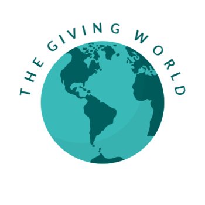
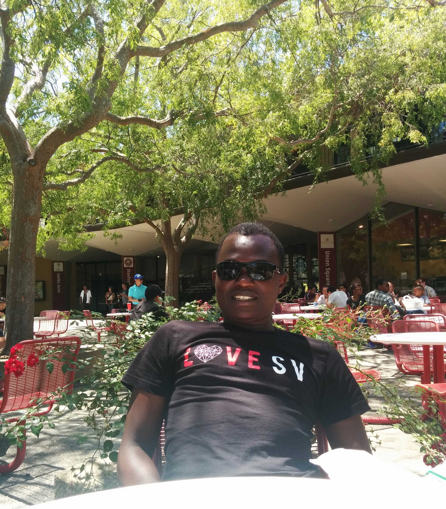

# Team-11

## Project Synopsis 
 * Make it easier for people to find places to donate
 * Connect people to charities based on skills, giving needs, location, charity reviews, interest
 * Reviews
    * Star reviews based on who has donated
 * Give people donation history
    * Design UI that allows people help with their taxes thorugh having all the necessary information about their donations
 * We give people ease of connection and encouragement through:
    * Reviews
    * UI
    * Locality
  * Allow people to sign up for notifications:
    * As needs arise, notify people about opportunities that match their giving needs
  * Allow people to opt-in to a newsletter, either from specific 
    
    
 * Why this project is necessary right now:
   * Recent tax cut made less incentives for small donations; there will likely be a drop in small donations, so we want to make it as easy as possible to donate
   * Current non-profit aggregating websites do their job poorly; bad UIs that encourage donation to the website over donating to charities
   * No reviews of charities
   * Useful for new charities - we can highlight
   
   
## Benchmarking

Similar concept, bad UI: https://www.charitynavigator.org

Give small loans: https://www.kiva.org

## Team Members
| Member                | Photo                                         |
| --------------------- | --------------------------------------------- |
| Austin Jacobs         |   |
| Kathleen Kenealy      |   |
| Josh DuFault          |  |
| Alfonce Nzioka        |  |

<!---  --->

## Team Skills
| Member                | Skills                        | Personal Traits  | Desired Growth | Weaknesses |
| --------------------- | ----------------------------- | ---------------- | -------------- | ---------- |
| Austin Jacobs    | Web/Mobile developement, Spark, Databases, NLP | Organized, motivated, detail-oriented | UI design, project management | Perfectionist |
| Kathleen Kenealy | ML, NLP, Python, algorithms/theory & analysis, UI/UX | Collaborative, dedicated, organized | OOD, full stack integration/design | Less experienced with full stack design |
| Josh DuFault | ML, Deep Learning, NLP, Data Analysis, Spark, Python, C++, Java | Collaborative, dedicated | SDLC | UI |
| Alfonce Nzioka |Deep Learning, NLP, C++, MEAN stack dev, C++, Python, Desktop applications(using javafx)|Self-driven, time-conscious| Rapid prototyping, UI design, Mobile dev|Too independent|

## Team Communication

Slack: https://cs194-team-11.slack.com

Google Drive: https://drive.google.com/open?id=1MCHVAQ9Ul1zvphH2DUY6PSVTMUDaPvc3

## Contact Information

Austin Jacobs: ajacobs7@stanford.edu

Kathleen Kenealy: kkenealy@stanford.edu

Josh DuFault: jdufault@stanford.edu

Alfonce Nzioka: alfonce@stanford.edu

Cary Huang: carykh@stanford.edu
